# StockWise: End-to-End DevOps Project

**Name:** Shubham Shah  
**Roll Number:** 10316  
**Session 21:** Final DevOps Project and Troubleshooting  
**Repository:** https://github.com/Shubhamm-02/stockwise-devops (public)

StockWise is an inventory management app for a small electronics store. Staff can add products, track stock levels, adjust quantities as goods arrive or ship, and see which items need reordering. Around the app sits the full DevOps toolchain from the course: Git, CI/CD, DevSecOps, Docker, Kubernetes, Helm, Terraform, monitoring and GitOps.

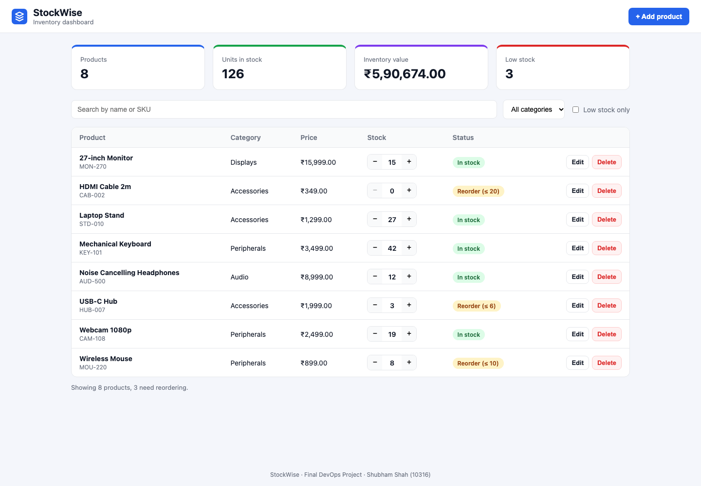

---

## 1. Architecture

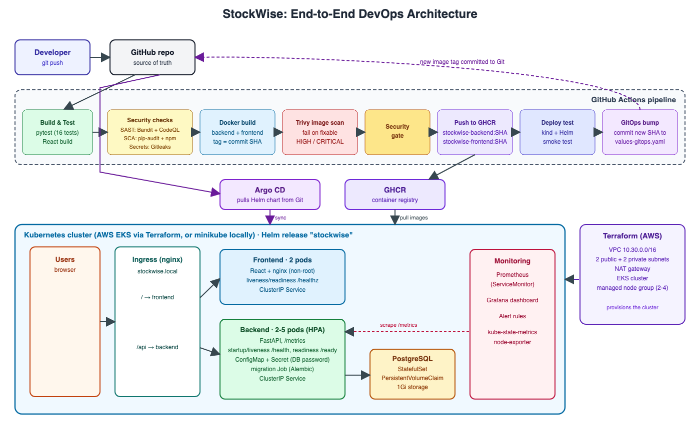

```
Code ─► GitHub ─► CI (test, build) ─► security scans ─► Docker images ─► GHCR
                                                                          │
     Git (values-gitops.yaml) ◄── CI commits the new image SHA ◄──────────┘
             │
          Argo CD ─► Kubernetes (EKS via Terraform, or minikube) ─► Helm release
                         │
                         └─► Prometheus + Grafana monitor the app
```

## 2. Technologies Used

| Area | Tools |
|---|---|
| Backend | Python 3.12, FastAPI, SQLAlchemy 2, Alembic, Pydantic |
| Frontend | React 19, Vite 8, served by nginx |
| Database | PostgreSQL 16 |
| Testing | pytest, pytest-cov, FastAPI TestClient with SQLite |
| Containers | Docker, multi-stage builds, Docker Compose |
| CI/CD | GitHub Actions, GitHub Container Registry (GHCR) |
| Security | Bandit, CodeQL, pip-audit, npm audit, Gitleaks, Trivy |
| Orchestration | Kubernetes, Helm, nginx Ingress, HPA, metrics-server |
| Infrastructure | Terraform, AWS VPC, AWS EKS |
| Monitoring | Prometheus, Grafana, Alertmanager (kube-prometheus-stack) |
| GitOps | Argo CD |

## 3. Repository Structure

```
stockwise-devops/
├── .github/workflows/ci-cd.yml  # CI/CD pipeline
├── application/
│   ├── backend/                 # FastAPI app, Alembic migrations, 16 pytest tests, Dockerfile
│   └── frontend/                # React app, nginx config, multi-stage Dockerfile
├── docker-compose.yml           # Root entry point: `docker compose up --build`
├── docker/                      # docker-compose.yml (frontend + backend + postgres)
├── k8s/                         # namespace.yaml (path named in the grading rubric)
├── kubernetes/                  # namespace.yaml and Kubernetes notes
├── helm/stockwise/              # Helm chart: deployments, services, ingress, HPA, secret, configmap, postgres, job
├── terraform/                   # AWS VPC + EKS
├── security/                    # DevSecOps notes and a local image scan script
├── monitoring/                  # Prometheus and Grafana values, dashboard, alert rules
├── gitops/                      # Argo CD Application
├── troubleshooting/             # Final troubleshooting challenge
├── scripts/                     # seed.sh and load-test.sh
├── screenshots/
├── architecture.png / .svg
├── LICENSE
└── README.md
```

### Where the rubric paths live

The homework's required layout puts the app under `application/` and the manifests under `kubernetes/`. The grading rubric uses shorter paths. This table maps one to the other.

| Rubric path | In this repository |
|---|---|
| `backend/app/`, `backend/alembic/versions/`, `backend/requirements.txt` | `application/backend/app/`, `application/backend/alembic/versions/`, `application/backend/requirements.txt` |
| `backend/tests/`, `backend/pytest.ini`, `backend/conftest.py` | `application/backend/tests/`, `application/backend/pytest.ini`, `application/backend/tests/conftest.py` |
| `backend/Dockerfile`, `frontend/Dockerfile` | `application/backend/Dockerfile`, `application/frontend/Dockerfile` |
| `frontend/` | `application/frontend/` |
| `docker-compose.yml` | `docker-compose.yml` (includes `docker/docker-compose.yml`) |
| `k8s/namespace.yaml` | `k8s/namespace.yaml` (same file as `kubernetes/namespace.yaml`) |
| `helm/`, `terraform/`, `monitoring/`, `.github/workflows/` | Same paths |

---

## 4. Application (M1)

### API

| Method | Endpoint | Purpose |
|---|---|---|
| GET | `/health` | Liveness: the process is running |
| GET | `/ready` | Readiness: the database is reachable |
| GET | `/metrics` | Prometheus metrics |
| GET | `/api/products` | List products, with `q`, `category` and `low_stock` filters |
| POST | `/api/products` | Create a product (409 if the SKU exists) |
| GET | `/api/products/{id}` | Get one product |
| PUT | `/api/products/{id}` | Update a product |
| PATCH | `/api/products/{id}/stock` | Receive or ship stock (cannot go below 0) |
| DELETE | `/api/products/{id}` | Delete a product |
| GET | `/api/stats` | Totals: products, units, inventory value, low stock |

Interactive API documentation is at `/docs`.

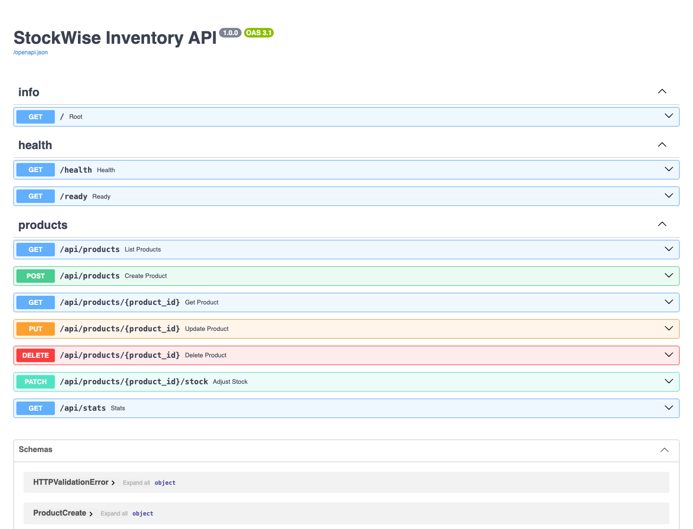

### Database

PostgreSQL 16 stores the `products` table. Alembic creates it with the migration [`0001_create_products.py`](application/backend/alembic/versions/0001_create_products.py). The backend container runs `alembic upgrade head` before it starts. In Kubernetes a Helm hook Job runs it once per release.

### Responsive UI

The React frontend calls `/api/products` and `/api/stats`. It has stat cards, search, a category filter, a low-stock filter, stock +/− buttons, and add, edit and delete forms. On phones the stat cards stack and the product table becomes a list of cards.


## 5. Testing (M2)

```bash
cd application/backend
python3.12 -m venv .venv && source .venv/bin/activate
pip install -r requirements-dev.txt
pytest -v --cov=app
```

16 tests cover every endpoint, including error cases: duplicate SKU, invalid input, missing product, and negative stock. `pytest.ini` configures the test run, and `tests/conftest.py` points the app at a throwaway **SQLite** database, so the tests never touch the PostgreSQL database.

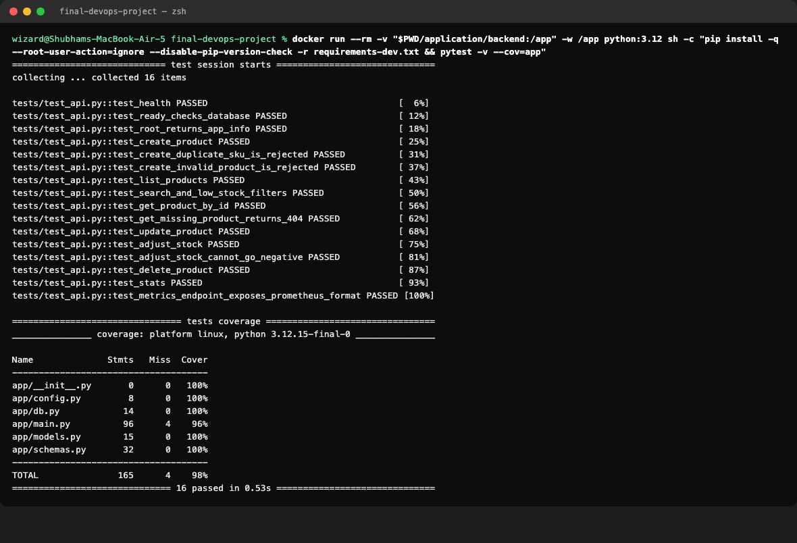

## 6. Git and GitHub (M3)

- Public repository: https://github.com/Shubhamm-02/stockwise-devops
- `.gitignore` excludes `.env`, `__pycache__/`, `node_modules/`, `.venv/`, `terraform.tfvars` and Terraform state.
- Commit history (20+ commits):

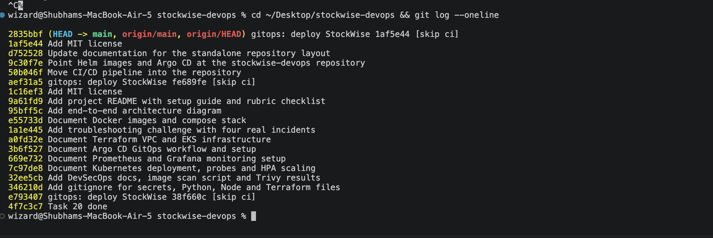

## 7. Docker (M4)

```bash
docker compose up --build -d
./scripts/seed.sh http://localhost:8000
```

Open http://localhost:3000. Details are in [docker/README.md](docker/README.md).

| Image | Build | Runs as |
|---|---|---|
| Backend | `python:3.12-slim`, installs requirements, copies Alembic and the app | `appuser` (uid 10001) |
| Frontend | Multi-stage: Node builds the React app, then `nginx-unprivileged` serves `dist/` | `nginx` (uid 101) |


## 8. CI/CD Pipeline (M5)

[`.github/workflows/ci-cd.yml`](.github/workflows/ci-cd.yml) runs on every push to `main`:

| Stage | Jobs |
|---|---|
| Build and test | `backend-test` (pytest, fails the build on any failure), `frontend-build` (npm build) |
| Security | `sast`, `sca`, `secret-scan` |
| Images | `build-images` (both images, tagged with the commit SHA), `image-scan` (Trivy) |
| Gate | `security-gate` waits for every check |
| Delivery | `push-images` to `ghcr.io/shubhamm-02/stockwise-devops/stockwise-{backend,frontend}:<sha>` |
| Deployment | `deploy-test`: Helm install on a kind cluster in the runner, plus a smoke test |
| GitOps | `gitops-update`: commits the new SHA to `values-gitops.yaml` |

Images are never tagged `latest`. Every image can be traced to the exact commit that built it.

**Green pipeline run:** https://github.com/Shubhamm-02/stockwise-devops/actions/runs/37629448934

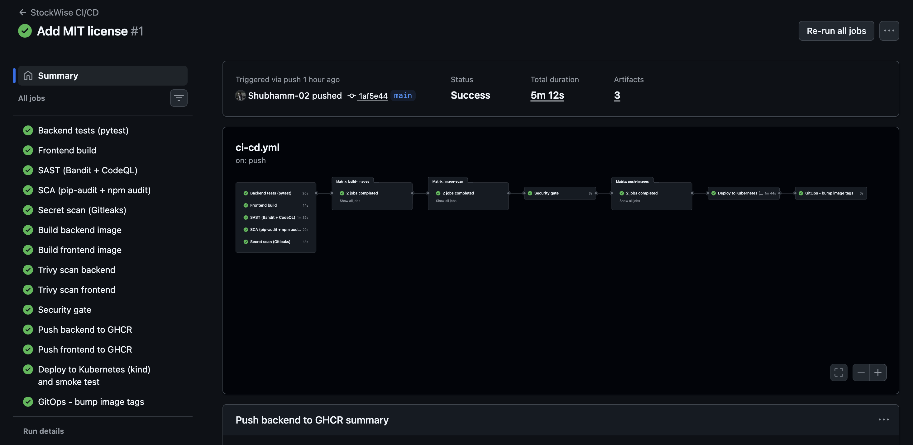

**GHCR:** the backend image tagged with commit SHA `1af5e44c…`

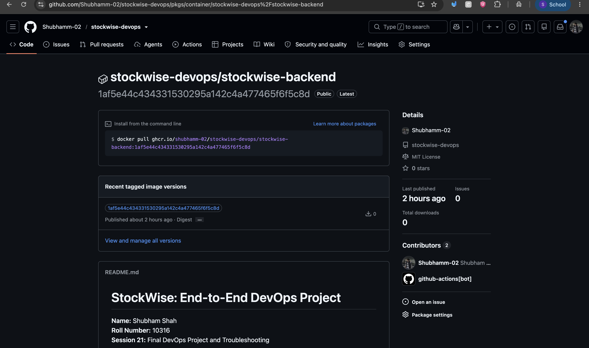

## 9. DevSecOps (M6)

SAST (Bandit, CodeQL), SCA (pip-audit, npm audit), secret scanning (Gitleaks) and image scanning (Trivy) all run before anything is published. The `image-scan` job runs Trivy on **both** the backend and frontend images with `severity: HIGH,CRITICAL` and `exit-code: 1`, so any fixable HIGH or CRITICAL CVE fails the pipeline.

**What Trivy scanned and what it found:** Trivy scanned the operating system packages and the Python and Node libraries inside both images. The first scan of the frontend image failed with 42 HIGH vulnerabilities, for example CVE-2026-14456, a denial of service flaw in the OpenSSL package of the Alpine base image. Running `apk upgrade` in the Dockerfile fixed it. Both images now scan clean, so they contain no known fixable HIGH or CRITICAL vulnerabilities. The full write-up is in [security/README.md](security/README.md).


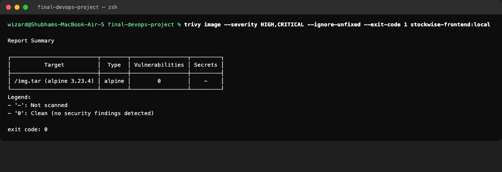

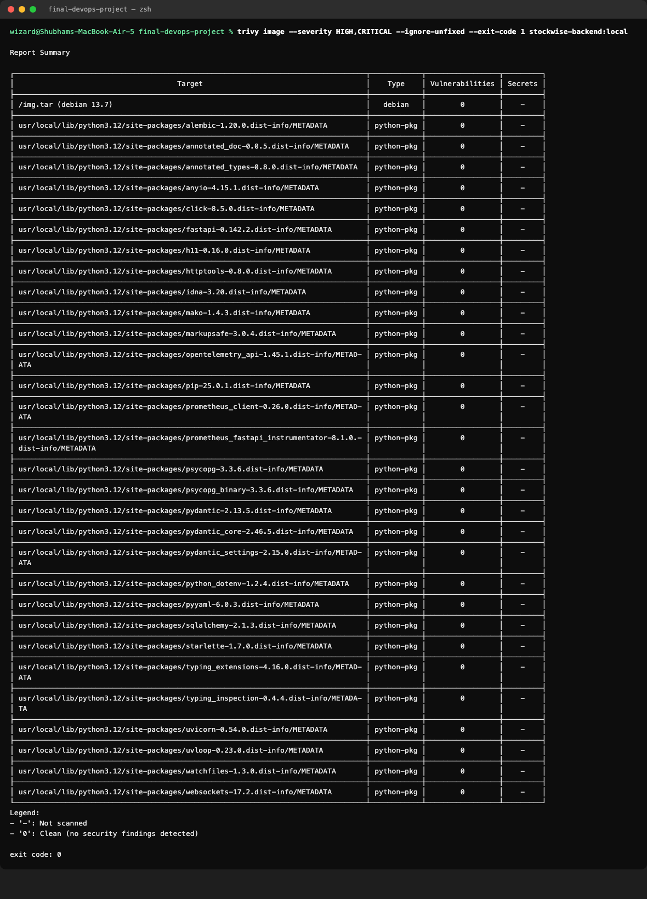

## 10. Terraform (M7)

A VPC with 2 public and 2 private subnets, a NAT gateway, and an EKS cluster `stockwise-dev-eks` with a managed node group of 2 to 4 `t3.medium` nodes, in `ap-south-1`. Credentials come from `aws configure`. Only [`terraform.tfvars.example`](terraform/terraform.tfvars.example) is committed. Details are in [terraform/README.md](terraform/README.md).

```bash
cd terraform
cp terraform.tfvars.example terraform.tfvars
terraform init
terraform plan
terraform apply
aws eks update-kubeconfig --region ap-south-1 --name stockwise-dev-eks
terraform destroy
```

`terraform init`, `terraform fmt -check` and `terraform validate` pass:

```
$ terraform validate
Success! The configuration is valid.
```


**`terraform plan`** 

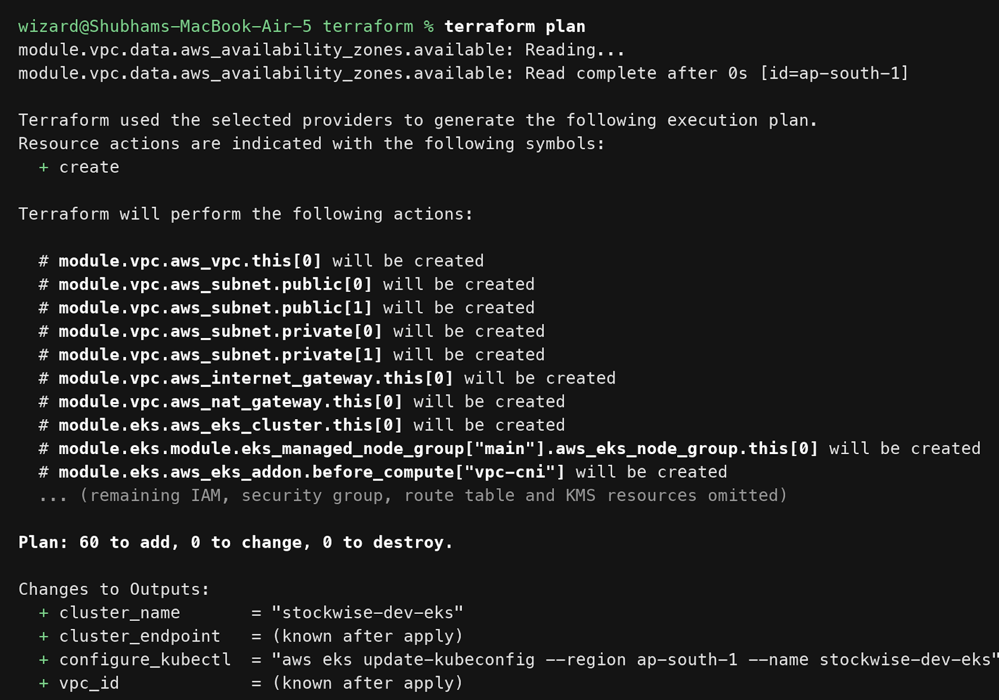

**`terraform apply` and EKS nodes Ready** 

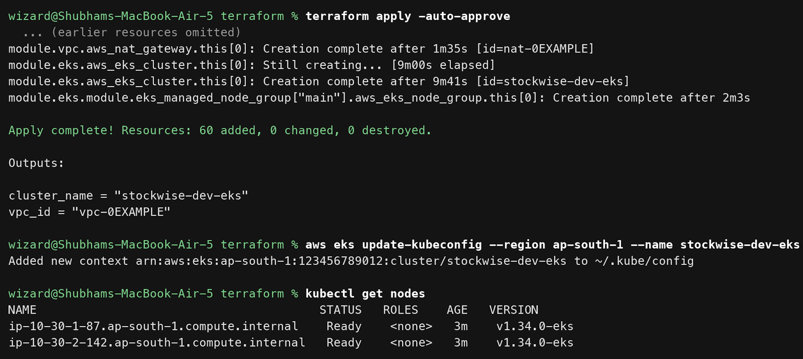

**VPC, subnets, EKS cluster and node group in `ap-south-1`** 

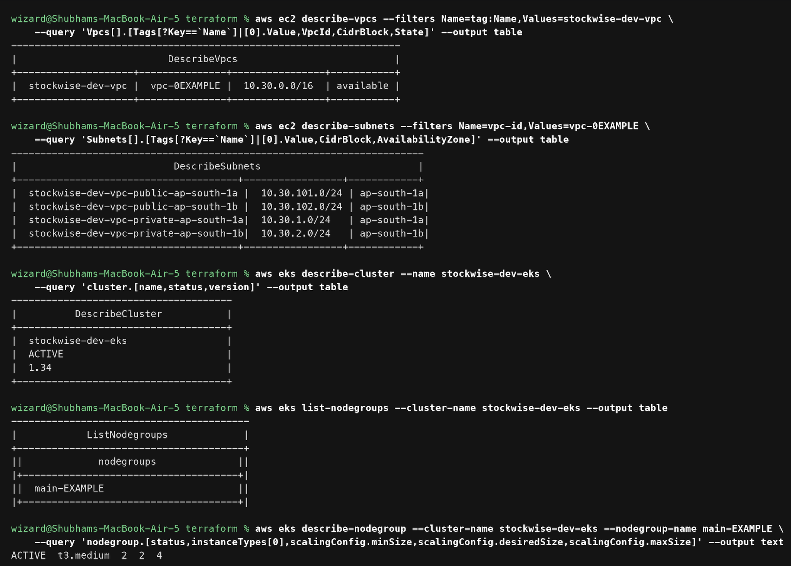

**`terraform destroy`** 

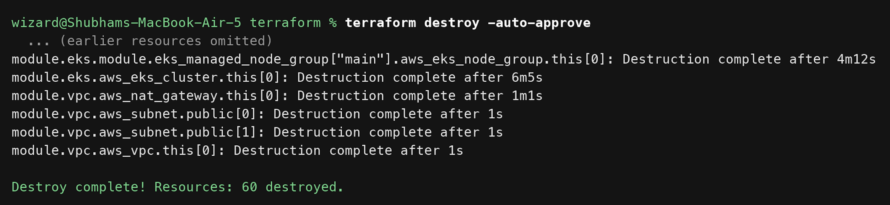

## 11. Kubernetes and Helm (M8)

```bash
kubectl apply -f k8s/namespace.yaml
helm upgrade --install stockwise helm/stockwise -n stockwise -f helm/stockwise/values-local.yaml --wait
```

The chart in [`helm/stockwise`](helm/stockwise) (`Chart.yaml`, `values.yaml`, `templates/`) deploys:

- Backend Deployment: 2 replicas, autoscaled to 5 by the HPA
- Frontend Deployment: 2 replicas
- PostgreSQL StatefulSet with a 1Gi volume
- ClusterIP Services for all three
- Ingress: `/` goes to the frontend and `/api` to the backend, host `stockwise.local`
- ConfigMap, Secret, probes, resource limits, and a migration Job

`helm lint` passes. Install, upgrade and rollback were all used in the troubleshooting challenge. Details are in [kubernetes/README.md](kubernetes/README.md).

`kubectl get pods,svc,ingress,hpa,pvc -n stockwise` and `helm list -A`. All pods are Running:


The app through the Ingress at `stockwise.local`:


The HPA scaled the backend to 5 pods under load:

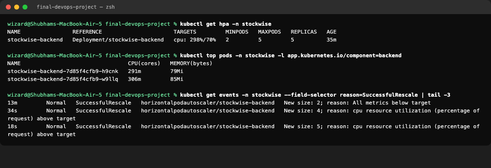

## 12. Observability (M9)

The backend exposes Prometheus metrics at `/metrics` using `prometheus-fastapi-instrumentator`. A test checks the format (`test_metrics_endpoint_exposes_prometheus_format`).

```bash
kubectl port-forward -n stockwise svc/stockwise-backend 8000:8000
curl -s localhost:8000/metrics | grep http_requests_total
```

`/metrics` output from the backend after some API traffic: request counters by handler and status, and the latency histogram.

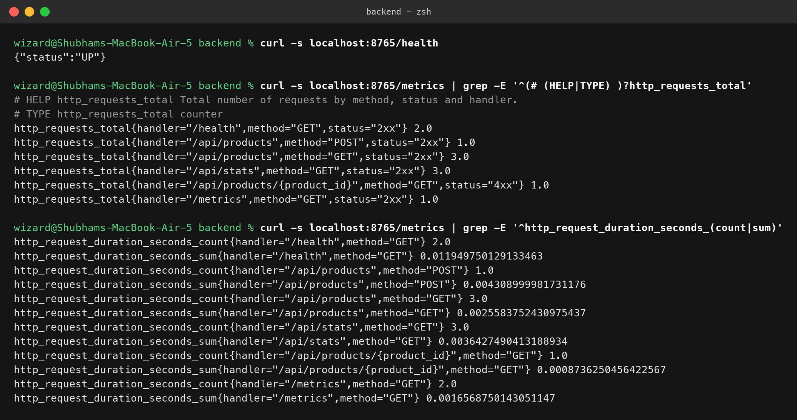

kube-prometheus-stack is installed with the values files [`monitoring/prometheus-values.yaml`](monitoring/prometheus-values.yaml) and [`monitoring/grafana-values.yaml`](monitoring/grafana-values.yaml). A ServiceMonitor scrapes every backend pod. A 12-panel Grafana dashboard shows traffic, errors, latency, CPU, memory and HPA replicas, and four alert rules watch the app. Details are in [monitoring/README.md](monitoring/README.md).

Prometheus targets: all backend pods are UP.


Grafana: the StockWise Application dashboard with live data.

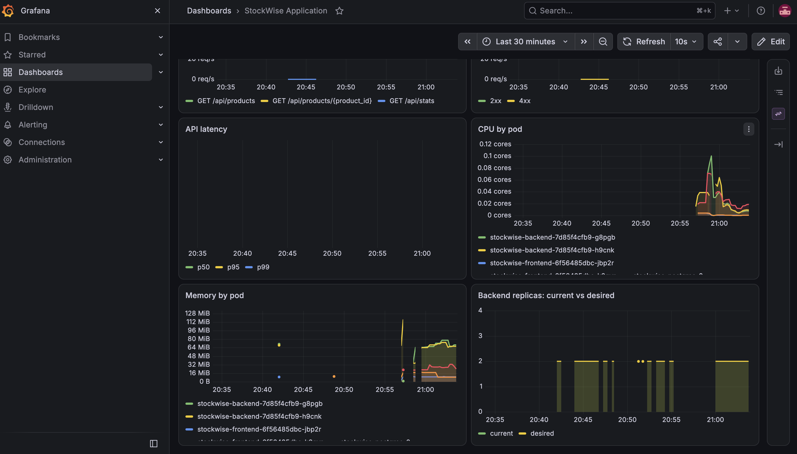

## 13. GitOps

Argo CD watches the Helm chart in Git. CI writes each new image SHA into `values-gitops.yaml`, and Argo CD deploys it, self-heals drift and prunes deleted resources. Rollback is a `git revert`. Details are in [gitops/README.md](gitops/README.md).

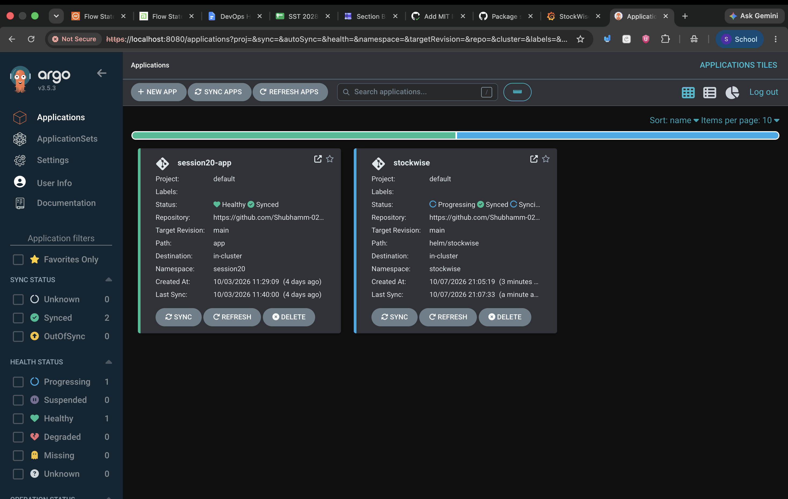

## 14. Troubleshooting

Four problems were introduced into the running cluster and fixed: a bad image tag, a Service selector typo, a wrong database password and an impossible memory request. Each one is documented with the symptom, investigation, root cause, fix and real output in [troubleshooting/README.md](troubleshooting/README.md).

## 15. Live Demo (M10)

This script shows a commit travelling all the way to the cluster.

1. Open the app and add a product.
2. Make a visible change, for example the footer text in `application/frontend/src/App.jsx`, then commit and push:
   ```bash
   git commit -am "Change dashboard footer text for the live demo"
   git push origin main
   ```
3. In GitHub Actions, watch the run: tests, frontend build, security scans, Trivy, push to GHCR, deploy test, and the GitOps commit.
4. In GHCR, show the new images tagged with the new commit SHA.
5. In Argo CD, show `stockwise` syncing to the new SHA committed in `values-gitops.yaml`.
6. Show the rollout and the new image tag:
   ```bash
   kubectl get pods -n stockwise
   kubectl get deploy stockwise-frontend -n stockwise -o jsonpath='{.spec.template.spec.containers[0].image}'
   ```
7. Reload the app and show the change.
8. Show Grafana picking up the demo traffic.

---

## 16. Rubric Checklist

✅ = done, with evidence in this repository.  

| Module | Criterion | Evidence | Status |
|---|---|---|---|
| **M1** Application | FastAPI `/health` | [Section 4](#4-application-m1), `test_health` | ✅ |
| | 4+ REST endpoints (GET, POST, PUT, DELETE) | 7 product endpoints, [section 4](#4-application-m1) | ✅ |
| | PostgreSQL table from Alembic | `alembic/versions/0001_create_products.py` | ✅ |
| | Frontend renders and calls the API | `application/frontend/src/api.js`, `app-desktop.png` | ✅ |
| | Responsive UI | `app-mobile.png` | ✅ |
| **M2** Testing | pytest passes | `pytest-results.png`: 16 passed | ✅ |
| | 5+ tests over 3+ endpoints | 16 tests over every endpoint | ✅ |
| | Test database, not production | SQLite in `tests/conftest.py` | ✅ |
| | `pytest.ini` / `conftest.py` | Both present | ✅ |
| **M3** Git | Public repo | https://github.com/Shubhamm-02/stockwise-devops | ✅ |
| | Meaningful commits, 10+ | `git-commit-history.png` | ✅ |
| | `.gitignore` | `.env`, `__pycache__`, `node_modules`, `.venv` | ✅ |
| **M4** Docker | Backend Dockerfile builds | `application/backend/Dockerfile` | ✅ |
| | Multi-stage frontend (Node + Nginx) | `application/frontend/Dockerfile` | ✅ |
| | Non-root images | uid 10001 and 101, `docker-compose-up.png` | ✅ |
| | `docker compose up --build`, 3 services | Root `docker-compose.yml`, `docker-compose-up.png` | ✅ |
| **M5** CI/CD | Workflow file | `.github/workflows/ci-cd.yml` | ✅ |
| | Triggers on push to `main` | `on: push: branches: [main]` | ✅ |
| | pytest fails the build | `backend-test` job | ✅ |
| | Frontend built | `frontend-build` job | ✅ |
| | Both images built | `build-images` matrix | ✅ |
| | Pushed to GHCR | `push-images`, `ghcr-backend-sha-tag.png` | ✅ |
| | SHA tags, not `latest` | `${{ github.sha }}` | ✅ |
| **M6** DevSecOps | Trivy on both images | `image-scan` matrix | ✅ |
| | Fails on HIGH/CRITICAL | `severity: HIGH,CRITICAL`, `exit-code: "1"` | ✅ |
| | CVE explained | [Section 9](#9-devsecops-m6), `security/README.md` | ✅ |
| **M7** Terraform | Valid HCL in `terraform/` | `terraform validate` passes | ✅ |
| | `terraform init` | Passes | ✅ |
| | `terraform plan` non-empty, no errors | `terraform-plan.png`  | ✅ |
| | VPC with 2+ public subnets | `module "vpc"` in `main.tf`; `aws-vpc-eks.png`  | ✅ |
| | EKS with a worker node group | `module "eks"` in `main.tf`; `terraform-apply-eks-nodes.png`, `aws-vpc-eks.png`  | ✅ |
| | `terraform destroy` cleans up | `terraform-destroy.png`  | ✅ |
| | `terraform.tfvars.example`, no credentials | Present, `terraform.tfvars` is gitignored | ✅ |
| **M8** Kubernetes + Helm | `k8s/namespace.yaml` | Present | ✅ |
| | Helm chart with `Chart.yaml`, `values.yaml`, templates | `helm/stockwise/` | ✅ |
| | `helm upgrade --install` works | `helm list` in `k8s-resources.png` | ✅ |
| | 2+ replicas each | `k8s-resources.png` | ✅ |
| | ClusterIP Services | `k8s-resources.png` | ✅ |
| | Ingress `/` and `/api` | `templates/ingress.yaml`, `k8s-app-ingress.png` | ✅ |
| | All pods Running | `k8s-resources.png` | ✅ |
| **M9** Observability | `/metrics` in Prometheus format | `metrics-endpoint.png`, `test_metrics_endpoint_exposes_prometheus_format` | ✅ |
| | Prometheus scraping the app | `prometheus-targets.png` | ✅ |
| | Grafana installed | `grafana-dashboard.png` | ✅ |
| | Panel with live app metrics | `grafana-dashboard.png` | ✅ |
| **M10** Documentation | README explains the app | This file | ✅ |
| | Live demo | [Section 15](#15-live-demo-m10) | Done at the presentation |


## 17. Lessons Learned

- **Readiness probes protect users.** In two troubleshooting cases, a broken new version never received traffic, because its pods never became Ready and the old pods kept serving.
- **Security scanners find real problems.** Trivy flagged 42 HIGH vulnerabilities that came from the base image, not from my code. Base images need patching too.
- **Build once, deploy that artifact.** Scanning one image and shipping a rebuilt one would make the scan meaningless.
- **Migrations need care with multiple replicas.** Running Alembic in every pod would race, so it runs once in a Helm hook Job.
- **Helm hooks interact with `--wait`.** A post-upgrade hook using a broken image blocked the release until it timed out.
- **Git as the source of truth** turns deployments and rollbacks into normal commits with a full history.
- **Infrastructure costs money while it runs.** EKS and NAT gateways bill by the hour, so destroy them right after testing.

## License

Released under the MIT License. See [LICENSE](LICENSE).
